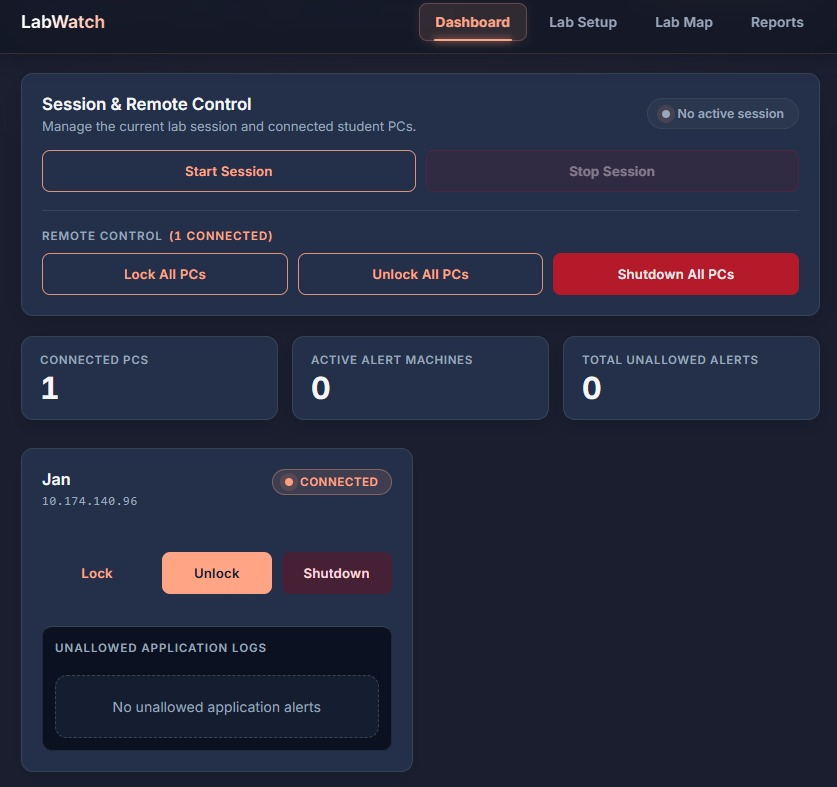

# Centralized Lab Monitoring System

A centralized monitoring and management system designed for computer laboratories. The system enables an administrator to monitor connected client PCs, configure permitted applications, detect restricted application usage, manage client systems, and view activity through a centralized web dashboard.

## Overview

Managing a computer laboratory with multiple systems can make it difficult for administrators to monitor activity and manage individual machines efficiently.

The **Centralized Lab Monitoring System** provides a centralized solution consisting of:

* A **FastAPI-based server** for managing connected clients
* Lightweight **Python client software** running on lab PCs
* A **React-based web dashboard** for administrators
* Automatic server discovery using **Zeroconf**
* Process monitoring for application usage
* Configurable application rules
* Centralized commands such as lock, unlock, and shutdown
* Activity logging and reporting

The current implementation operates over a **local network**, making it suitable for controlled environments such as college computer laboratories.

---

## Dashboard Preview



---

## Key Features

### Centralized Client Monitoring

* Registers client PCs with the central server
* Maintains information about connected systems
* Monitors processes running on client machines
* Detects applications that are not permitted by the configured lab rules

### Application Rule Management

Administrators can configure applications that are permitted for laboratory activities.

The client monitors running processes and checks them against the configured rules.

For example:

```text
Allowed Applications
├── Visual Studio Code
├── Google Chrome
└── Python
```

When a restricted application is detected, the activity can be recorded for monitoring and reporting.

### Centralized System Control

The administrator can send commands to client machines through the dashboard.

Supported commands include:

* Lock
* Unlock
* Shutdown

The system also supports centralized actions across multiple connected client machines.

### Automatic Server Discovery

The system uses **Zeroconf** to allow clients to discover the server automatically on the local network.

This removes the need to manually configure the server IP address on every client machine.

### Web Dashboard

The React-based dashboard provides an interface for:

* Viewing connected clients
* Monitoring laboratory systems
* Configuring application rules
* Managing client machines
* Viewing activity and reports

### Activity & Reporting

The system records relevant activity information that can be used to generate reports and summaries of laboratory usage.

---

## System Architecture

```text
                         ┌─────────────────────────┐
                         │      Admin / Server     │
                         │           PC            │
                         │                         │
                         │     FastAPI Server      │
                         │           │             │
                         │           │             │
                         │     React Dashboard     │
                         └───────────┬─────────────┘
                                     │
                              Local Network
                                     │
                    ┌────────────────┼────────────────┐
                    │                │                │
                    ▼                ▼                ▼
              ┌───────────┐    ┌───────────┐    ┌───────────┐
              │ Client 01 │    │ Client 02 │    │ Client N  │
              │           │    │           │    │           │
              │  Python   │    │  Python   │    │  Python   │
              │  Client   │    │  Client   │    │  Client   │
              │  Agent    │    │  Agent    │    │  Agent    │
              └───────────┘    └───────────┘    └───────────┘
```

### Communication Flow

```text
Client starts
     ↓
Zeroconf discovers server
     ↓
Client registers with server
     ↓
Communication established
     ↓
Server maintains client information
     ↓
Administrator uses dashboard
     ↓
Rules / Commands sent to client
     ↓
Client performs requested action
     ↓
Activity information returned to server
```

---

## Technology Stack

| Component             | Technologies                             |
| --------------------- | ---------------------------------------- |
| **Backend**           | Python, FastAPI, WebSockets              |
| **Service Discovery** | Zeroconf                                 |
| **Frontend**          | React, Vite, JavaScript, CSS             |
| **Client**            | Python, Windows APIs, Process Monitoring |
| **Communication**     | WebSockets / HTTP                        |

---

## How the System Works

1. The administrator starts the central server.
2. The server becomes discoverable on the local network using Zeroconf.
3. Client machines discover the server automatically.
4. Each client registers itself with the server.
5. The server maintains information about connected clients.
6. The administrator accesses the web dashboard.
7. Application rules can be configured for the laboratory.
8. Client machines monitor running processes.
9. Restricted application usage can be detected.
10. Administrators can send commands to individual or multiple client machines.
11. Activity information is recorded and made available for reporting.

---

## Setup

Detailed setup instructions are provided separately for each component:

* **Client Setup:** See [`client/README.md`](client/README.md)
* **Server & Dashboard Setup:** See [`server/README.md`](server/README.md)

---

## Current Scope

The current version focuses on **local-network laboratory monitoring and centralized management**.

The implemented system includes:

* Client registration
* Automatic server discovery
* Process monitoring
* Application rule configuration
* Centralized client commands
* Dashboard-based monitoring
* Activity logging
* Reporting

---

## Future Scope

Potential future enhancements include:

* Cloud-based remote monitoring
* Authentication and role-based access control
* Database-backed persistent storage
* Advanced activity analytics
* Notifications and alerts
* Improved scalability for larger laboratories
* Centralized software deployment
* Enhanced monitoring and reporting capabilities

---

## Academic Project

**Centralized Lab Monitoring System**

A Computer Science & Engineering academic project focused on centralized monitoring and management of computer laboratory systems.
